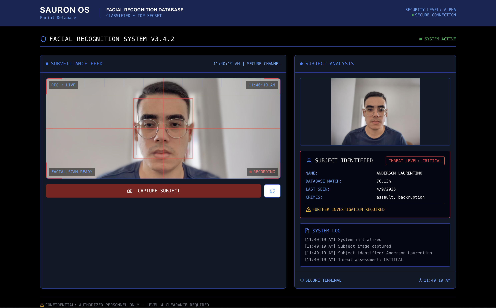

# Sauron Vigilance OS



## Docker Setup

### 1. To run both frontend and backend services:
```
docker-compose up
```

### 2. Access: [http://localhost:3000](http://localhost:3000)


## Standard Setup

### 1. Run Backend
```
cd back/

python3 -m pip install -r requirements.txt

uvicorn main:app --reload
```

### 2. Run Frontend
```
cd front/

npm install

npm run dev
```

### 3. Access: [http://localhost:3000](http://localhost:3000)